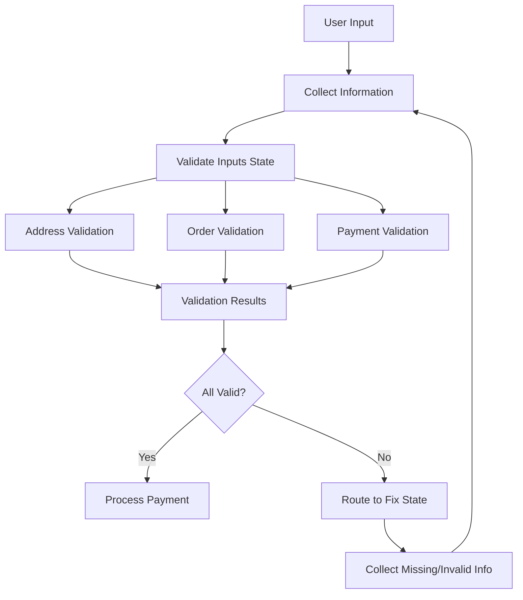

# Pizza Agent Validation System Overview

## Summary

This document provides a comprehensive overview of the validation engine implementation for the Pizza Agent system. The validation system has been fully integrated with the LangGraph conversation flow to provide robust, real-time validation of customer orders.

## Architecture Overview

### Core Components

1. **Address Validator** (`validation/address_validator.py`)
   - Google Maps Geocoding API integration
   - 5-mile delivery radius enforcement
   - Address standardization and caching
   - Real-time delivery feasibility checking

2. **Order Validator** (`validation/order_validator.py`)
   - Dynamic menu management with Redis caching
   - Pizza configuration validation (size, crust, toppings)
   - Quantity constraints and business rules
   - Real-time price calculation and verification

3. **Payment Validator** (`validation/payment_validator.py`)
   - Stripe API integration for secure payment processing
   - PCI-compliant credit card validation
   - Multiple payment method support (credit, debit, cash)
   - Luhn algorithm implementation for card validation

4. **Error Formatter** (`validation/error_formatter.py`)
   - User-friendly error message generation
   - Contextual suggestions for fixing validation issues
   - Multi-language support foundation
   - Structured error categorization

### Integration Points

#### LangGraph Agent Integration
- **State Management**: Validation results are stored in the OrderState for persistence across conversation turns
- **Conversation Flow**: Failed validations automatically route users back to appropriate collection states
- **Error Handling**: Graceful degradation with fallback messaging when external services are unavailable

#### Voice Interface Integration
- **Real-time Validation**: Phone orders are validated as information is collected
- **Audio-friendly Responses**: Error messages are optimized for voice delivery
- **Session Management**: Validation state is preserved across call interruptions

## Technical Implementation

### Validation Flow



### Key Features

#### Address Validation
- **Geocoding**: Real-time address lookup using Google Maps API
- **Distance Calculation**: Haversine formula for precise delivery range checking
- **Caching**: 24-hour TTL for geocoding results to improve performance
- **Fallback Handling**: Graceful degradation when geocoding services are unavailable

#### Order Validation
- **Menu Integration**: Dynamic menu loading with real-time availability checking
- **Business Rules**: Configurable constraints (max pizzas, topping limits, minimum order)
- **Price Verification**: Automatic recalculation and validation of order totals
- **Inventory Management**: Real-time checking of item availability

#### Payment Validation
- **Stripe Integration**: Full PCI-compliant payment processing
- **Card Validation**: Client-side format validation with server-side verification
- **Multiple Methods**: Support for credit cards, debit cards, and cash on delivery
- **Security**: Tokenized payment handling with no sensitive data storage

### Error Handling and User Experience

#### User-Friendly Messaging
- **Clear Communication**: Error messages explain what's wrong and how to fix it
- **Actionable Suggestions**: Specific steps provided for resolving validation issues
- **Progress Indicators**: Users can see which parts of their order are validated
- **Contextual Help**: Suggestions tailored to the specific validation failure

#### Fallback Strategies
- **Service Degradation**: System continues operating when external services are down
- **Default Validation**: Fallback rules when dynamic validation is unavailable
- **Manual Override**: Staff can assist customers when automated validation fails

## Performance Optimizations

### Caching Strategy
- **Address Geocoding**: 24-hour cache for geocoded addresses
- **Menu Data**: 30-minute cache for menu items and pricing
- **Restaurant Location**: 7-day cache for restaurant coordinates
- **Validation Results**: 10-minute cache for payment method validation

### Async Processing
- **Non-blocking Operations**: All validation operations are asynchronous
- **Parallel Validation**: Multiple validation checks run concurrently
- **Rate Limiting**: Respectful API usage with built-in rate limiting

## Testing Coverage

### Unit Tests
- **Individual Validators**: Comprehensive tests for each validation engine
- **Error Scenarios**: Tests for all failure modes and edge cases
- **Mock Integration**: Tests using mocked external services

### Integration Tests
- **Agent Integration**: Tests for validation integration with LangGraph agent
- **Voice Workflow**: Tests for phone call validation workflows
- **End-to-End**: Complete order flow validation testing

### Test Categories
1. **Address Validation Tests**
   - Valid addresses within delivery range
   - Addresses outside delivery range
   - Invalid/not found addresses
   - Geocoding service failures

2. **Order Validation Tests**
   - Valid pizza configurations
   - Invalid sizes, crusts, toppings
   - Quantity constraint violations
   - Menu availability scenarios

3. **Payment Validation Tests**
   - Valid payment methods
   - Invalid card information
   - Stripe integration scenarios
   - Cash payment handling

4. **Integration Tests**
   - Complete validation workflows
   - Multi-field validation failures
   - State routing verification
   - Error message formatting

## Configuration

### Environment Variables
```bash
# Google Maps API
GOOGLE_MAPS_API_KEY=your_google_maps_key
DELIVERY_RADIUS_MILES=5
RESTAURANT_ADDRESS="123 Main St, Anytown, CA 90210"

# Stripe Configuration
STRIPE_SECRET_KEY=sk_test_your_stripe_secret
STRIPE_PUBLISHABLE_KEY=pk_test_your_stripe_publishable

# Business Rules
MAX_PIZZAS_PER_ORDER=10
MINIMUM_ORDER_AMOUNT=15.00
```

### Redis Configuration
```bash
REDIS_URL=redis://localhost:6379
REDIS_PASSWORD=your_redis_password
```

## Usage Examples

### Address Validation
```python
from validation.address_validator import validate_address

result = await validate_address({
    "street": "123 Main St",
    "city": "Anytown", 
    "state": "CA",
    "zip": "90210"
})

if result["is_valid"]:
    print(f"Delivery to: {result['standardized_address']}")
    print(f"Distance: {result['delivery_distance_miles']} miles")
```

### Order Validation
```python
from validation.order_validator import validate_order

result = await validate_order({
    "pizzas": [
        {
            "size": "large",
            "crust": "thin",
            "toppings": ["pepperoni", "mushrooms"],
            "quantity": 2
        }
    ]
})

if result["is_valid"]:
    print(f"Order total: ${result['calculated_total']:.2f}")
```

### Payment Validation
```python
from validation.payment_validator import validate_payment_method

result = await validate_payment_method("credit_card")

if result["is_valid"]:
    print("Payment method accepted")
    if result["requires_card_details"]:
        print("Card information required")
```

## Future Enhancements

### Planned Features
1. **Multi-language Support**: Validation messages in multiple languages
2. **Advanced Analytics**: Validation failure tracking and optimization
3. **A/B Testing**: Testing different validation strategies
4. **Machine Learning**: Predictive validation based on customer patterns

### Scalability Improvements
1. **Distributed Caching**: Multi-node Redis cluster support
2. **Load Balancing**: Multiple validation service instances
3. **Circuit Breakers**: Advanced failure handling for external services
4. **Monitoring**: Comprehensive metrics and alerting

## Maintenance

### Regular Tasks
- **API Key Rotation**: Update Google Maps and Stripe API keys
- **Menu Updates**: Refresh default menu configuration
- **Cache Cleanup**: Monitor Redis memory usage
- **Test Updates**: Keep test data current with business changes

### Monitoring Points
- **Validation Success Rates**: Track percentage of successful validations
- **API Response Times**: Monitor external service performance
- **Error Frequencies**: Track common validation failure patterns
- **Cache Hit Rates**: Optimize caching strategies based on usage

## Conclusion

The Pizza Agent validation system provides a robust, user-friendly, and scalable foundation for order processing. With comprehensive error handling, performance optimization, and extensive testing coverage, the system ensures reliable operation while maintaining excellent user experience.

The modular architecture allows for easy extension and maintenance, while the integration with the LangGraph conversation flow provides seamless validation within the natural conversation context.